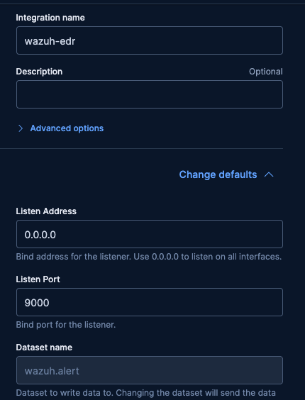
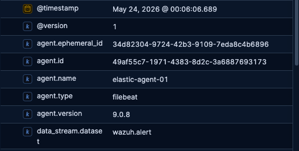
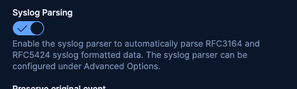
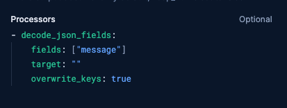
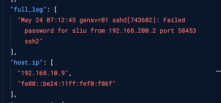
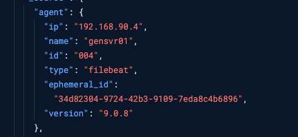
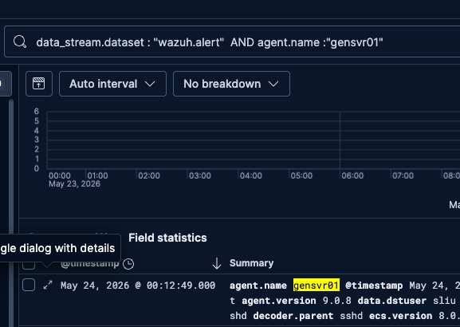

## 🛠️ Integration Guide: Wazuh to Elastic Agent

- Go to your Elastic Fleet console and add a Custom TCP Log integration. 

- Update wazuh managers config file for syslogging
- add below in /var/ossec/etc/ossec.conf
- and add it under ossec_config

<syslog_output>
    <server>192.168.10.9</server>
    <port>9000</port>
    <format>json</format>
</syslog_output>

- Restart Wazuh

sudo systemctl restart wazuh-manager

- tcp dump to check data is incoming on elastic agent port 9000

sudo tcpdump -i any udp port 9000 -v -X

- Now we get the logs but fields always show elastic-agent01

- The message shows us what we want to know, however in an unreadable format

To fix this we need to enable syslog parsing in fleet integration ad add a process

Now all the logs populate fields making it easier to search for and hunt logs 

- Example of searching

